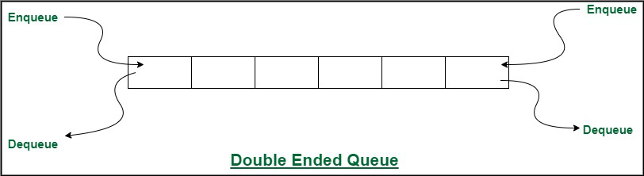
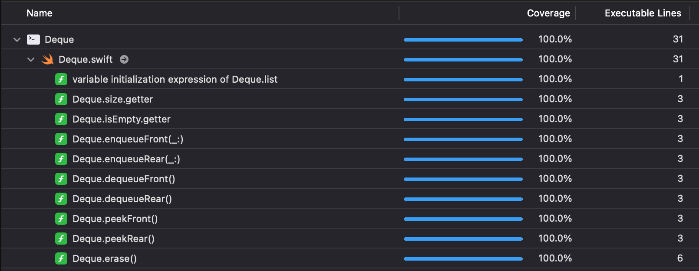

# Stack
This is a Deque (double ended queue) implementation.  
  
Picture [*source*](https://www.geeksforgeeks.org/different-types-of-queues-and-its-applications/)

## Table of contens
- [EnqueueFront](#enqueueFront)
- [DequeueFront](#dequeueFront)
- [PeekFront](#peekFront)
- [EnqueueRear](#enqueueRear)
- [DequeueRear](#dequeueRear)
- [PeekRear](#peekRear)
- [IsEmpty](#isEmpty)
- [Size](#size)
- [Erase](#erase)
- [Test coverage](#test-coverage)

### EnqueueFront()
Method that append item to the left end of queue.  
Complexity: *O(1)*

### DequeueFront()
Method that remove item from the left end of queue. Return value of item. Can return **nil** if queue was empty.  
Complexity: *O(1)*

### PeekFront()
Method allow to see what value is in front of the queue. Can return **nil** if queue is empty.  
Complexity: *O(1)*

### EnqueueRear()
Method that append item to the right end of queue.  
Complexity: *O(1)*

### DequeueRear()
Method that remove item from the right end of queue. Return value of item. Can return **nil** if queue was empty.  
Complexity: *O(1)*

### PeekRear()
Method allow to see what value is in rear of the queue. Can return **nil** if queue is empty.  
Complexity: *O(1)*

### IsEmpty
Property that return true if queue is empty.  
Complexity: *O(1)*

### Size
Property that return elements count of queue.  
Complexity: *O(1)*

### Erase()
Method that remove all elements from queue.  
Complexity: *O(n)*

### Test coverage

