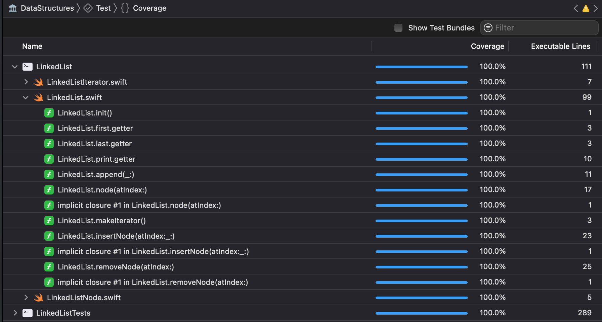

# Linked list
This is a doubly linked list implementation.  
  
Picture [*source*](https://www.geeksforgeeks.org/data-structures/linked-list/doubly-linked-list/)

## Table of contens
- [Node model](#node-model)
- [First](#first)
- [Last](#last)
- [Count](#count)
- [Append](#append)
- [Print](#print)
- [Node(atIndex:)](#node(atIndex:))
- [InsertNode](#insertNode(atIndex:))
- [RemoveNode](#removeNode(atIndex:))
- [Syntax sugar](#syntax-sugar)
- [Test coverage](#test-coverage)

### Node model
Model use generics as value for versatility.
```
final public class LinkedListNode<T> {
    var value: T
    var next: LinkedListNode?
    var previous: LinkedListNode?
    
    public init(_ value: T, 
		_ next: LinkedListNode? = nil, 
		_ previous: LinkedListNode? = nil) {
        self.value = value
        self.next = next
        self.previous = previous
    }
}
```


### First
Property that always hold reference to first element in linked list.  
Can return **nil** if list is empty.  
Complexity: *O(1)*

### Last
Property that always hold reference to last element in linked list.  
Can return **nil** if list is empty.  
Complexity: *O(1)*

### Count
Property that return count of elements in list.  
Complexity: *O(1)*

### Append
Method for appending a new element to end of the list with *O(1)* complexity

### Print
Method for printing all elements in command line like an array type [element1, element2, ..., elementn]  
Complexity: *O(n)*

### Node(atIndex:)
Method that return node element in list at specified index.  Can return **nil** if index is not exist.  
Complexity: *O(n)*

### InsertNode(atIndex:)
Method that allow you to insert new node at any position in list. Return **Bool** value that indicate success of insert operation.  
Complexity: 
- *O(1)* for inserting at start and end of list.  
- *O(index)* for inserting at other specific indicies.

### RemoveNode(atIndex:)
Method that allow you to delete node at any position in list. Can return **nil** if index out of bounds. Return **Node** that was deleted from list.
Complexity:
- *O(1) for deleting at start and end of list.
- *O(index)* for deleting at other specific indicies.

### Syntax sugar
You can traverse full list as standart iterator for an array
```
for node in list {
	print(node.val)
}
```
Complexity: *O(n)*

### Test coverage
