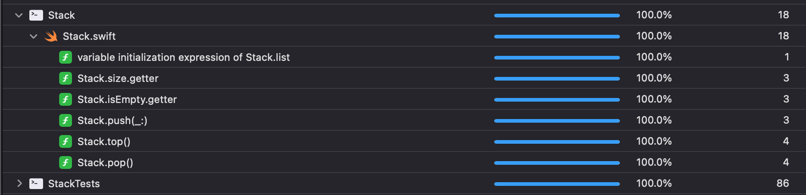

# Stack
This is a LIFO (last in first out) stack implementation.  
  
Picture [*source*](https://www.geeksforgeeks.org/stack-data-structure/)

## Table of contens
- [Push](#push)
- [Pop](#pop)
- [Top](#top)
- [isEmpty](#isEmpty)
- [Size](#size)
- [Test coverage](#test-coverage)

### Push
Method that add an item to the stack.  
Complexity: *O(1)*

### Pop
Method that remove top item from the stack.  
Complexity: *O(1)*

### Top
Method that show value of the top item in stack.  
Complexity: *O(1)*

### isEmpty
Property that return true if stack have no elements in it.  
Complexity: *O(1)*

### Size
Property that return count of items in stack.  
Complexity: *O(1)*

### Test coverage
